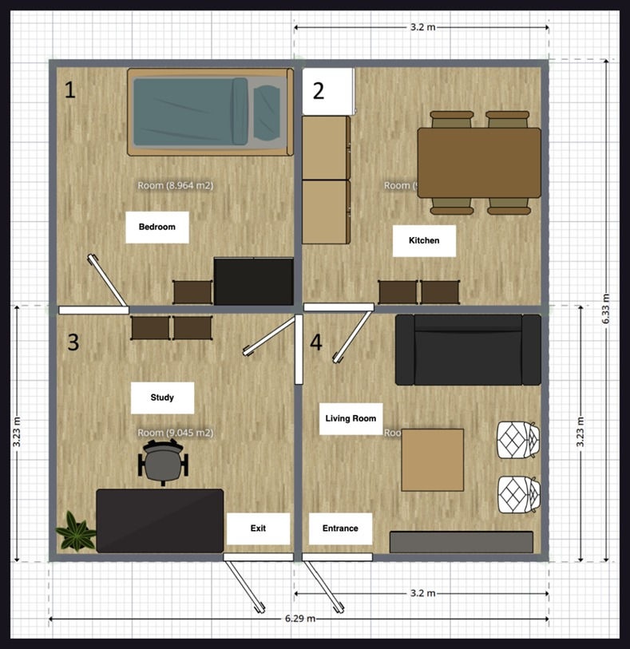

# Thailand Open ROS and Smart Robot Competition 2025

## Rules
### Open Platform League
- [Thailand Open Platform 2025 Rules](./documents/rules/OPLTH-Rule2025.pdf)
- [Rules reference](https://github.com/RoboCupAtHome/RuleBook/releases/download/2024.2/rulebook.pdf)

### Education League
- [Thailand Education 2025 Rules](./documents/rules/EDUTH-Rule2025.pdf)

## TDP Template
- [Template file](./documents/tdpTemplate/TDPTemplate.pdf)

## Qualify Materials Example
- [Explaination](./documents/rules/score-and-tdp-explaination.pdf)
- [Video Example](https://www.youtube.com/watch?v=FUKtgivErqE)
- [TDP Example](./documents/tdpTemplate/Kamenrider-TDP-example.pdf)

## Arena map

